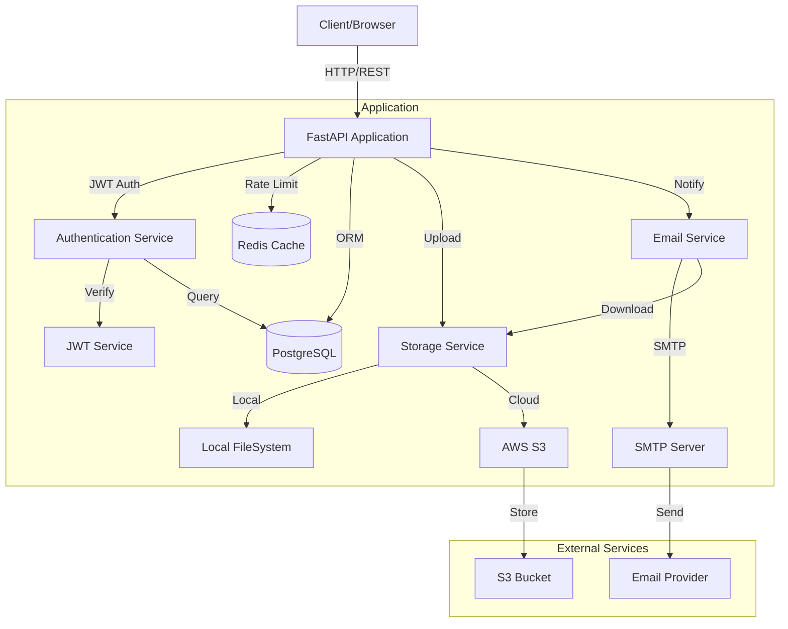
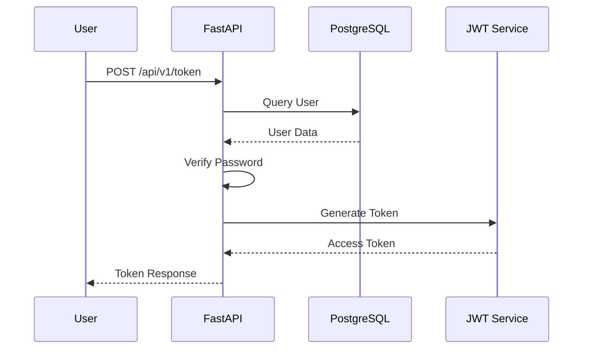
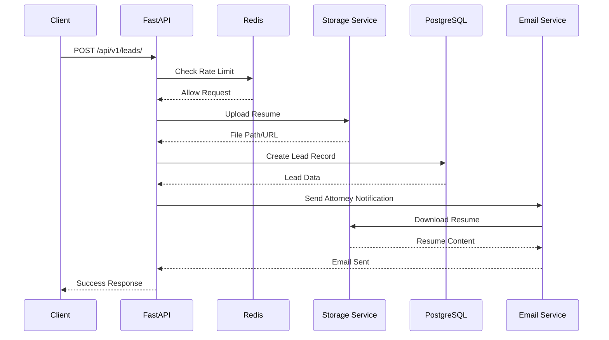
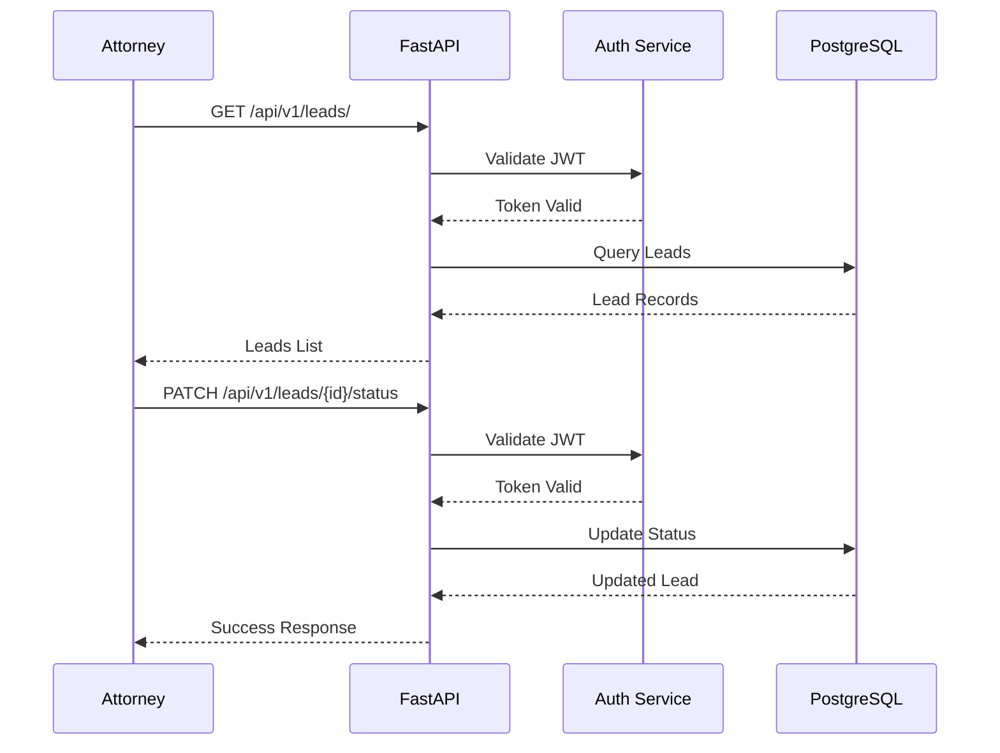
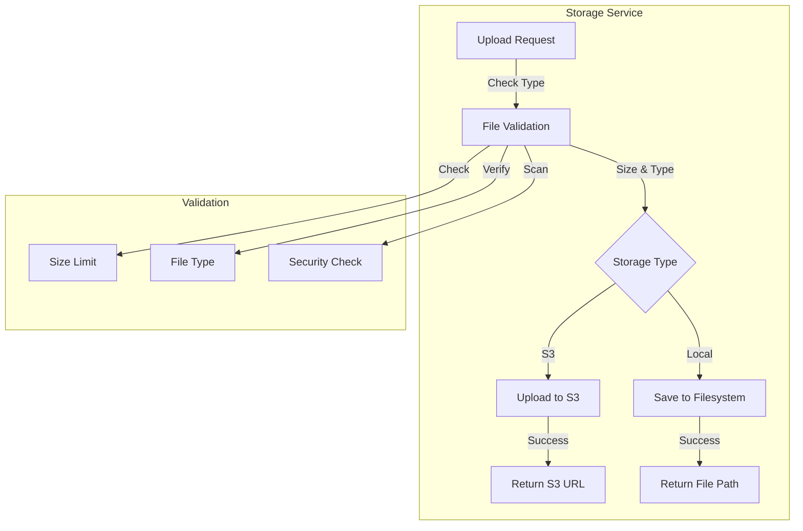
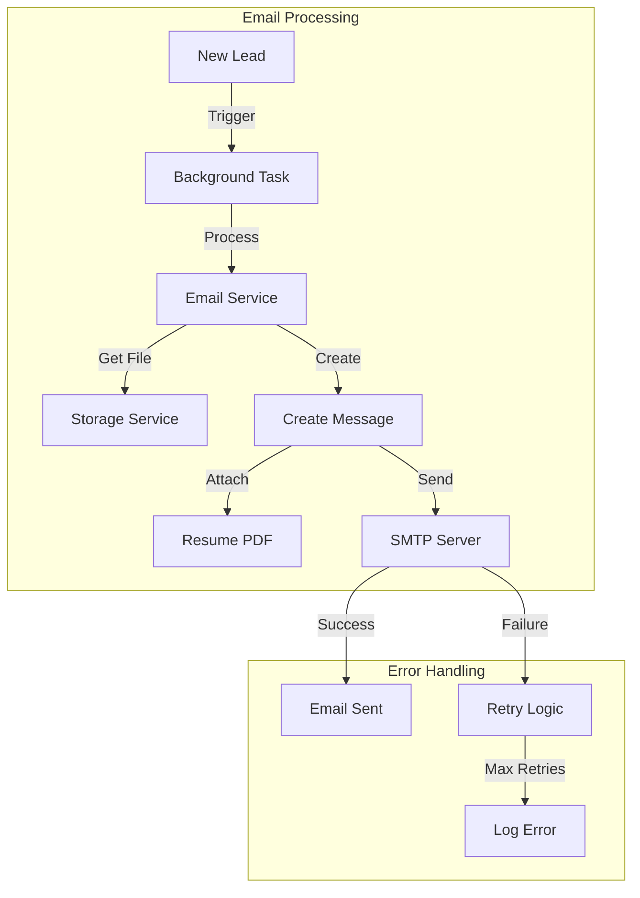
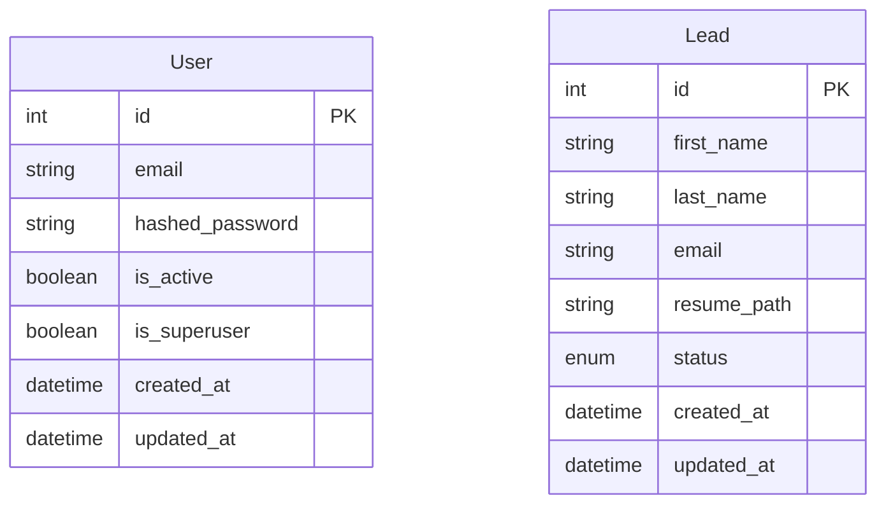

# Current System Design

## System Architecture

## Authentication Flow

## Lead Submission Flow

## Lead Management Flow

## File Storage Service

## Email Service Architecture

## Database Schema

## Key Components:

1. **FastAPI Application**
   - JWT-based authentication
   - Rate limiting with Redis
   - Async request handling
   - Input validation with Pydantic

2. **Storage Service**
   - Hybrid storage (Local/S3)
   - File validation
   - Secure file handling
   - Async operations

3. **Email Service**
   - Background task processing
   - SMTP integration
   - Resume attachment handling
   - Error handling & retries

4. **Database Layer**
   - PostgreSQL with SQLAlchemy ORM
   - Connection pooling
   - Migration support with Alembic
   - Audit fields (created_at, updated_at)

5. **Security Features**
   - JWT authentication
   - Rate limiting
   - File type validation
   - CORS configuration
   - Environment-based settings